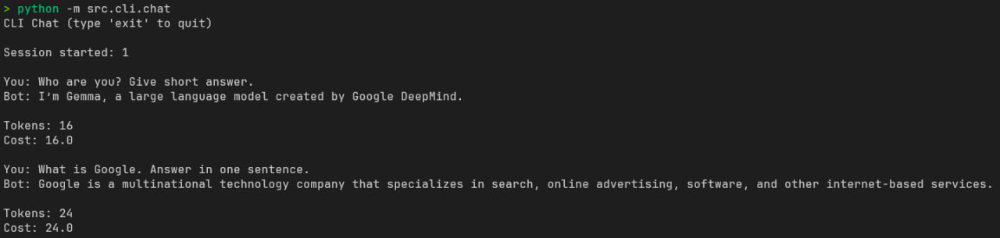
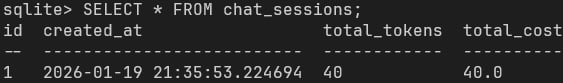
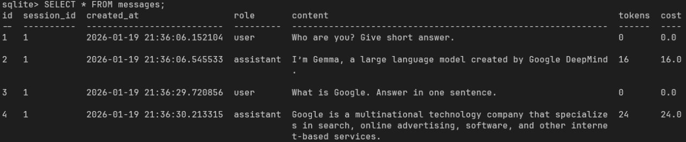

# Chat LLM API (FastAPI + SQLAlchemy)

A minimal chat backend with session tracking, token usage, and cost accounting.  
Designed to run **as Python modules from `src/`**.

---

## Features

- FastAPI REST API
- SQLite database
- Chat sessions + message history
- Token + cost tracking
- LLM calls

---

## Project Structure

```
.
├── chat.db
└── src
├── api
│   ├── main.py
│   └── routes
│       └── chat.py
├── db
│   ├── db.py
│   ├── init_db.py
│   └── models.py
├── llm
│   ├── base.py
│   ├── factory.py
│   └── ollama_client.py
├── schemas.py
└── config.py
````

---

## Install dependencies:

```bash
pip install -r requirements.txt
````

---

## Initialize Database (REQUIRED)

Before running the API, create the database:

```bash
python -m src.db.init_db
```

This will create `chat.db` and all tables.

---

## Run API

From the project root:

```bash
uvicorn src.api.main:app --reload
```

API will be available at:

```
http://127.0.0.1:8000
```

Swagger UI:

```
http://127.0.0.1:8000/docs
```

---

## API Endpoints

### Create chat session

```
POST /sessions/
```

### Send message

```
POST /sessions/{session_id}/messages
```

### Get chat history

```
GET /sessions/{session_id}
```

---

## Token Accounting Logic

* **Message.tokens** - tokens used for THIS response only
* **ChatSession.total_tokens** - sum of all assistant tokens
* User messages have `tokens = 0`
* Cost is calculated per message and accumulated per session

---

## Example Usage with CLI

\
\
Result in database: \
\

\
\
